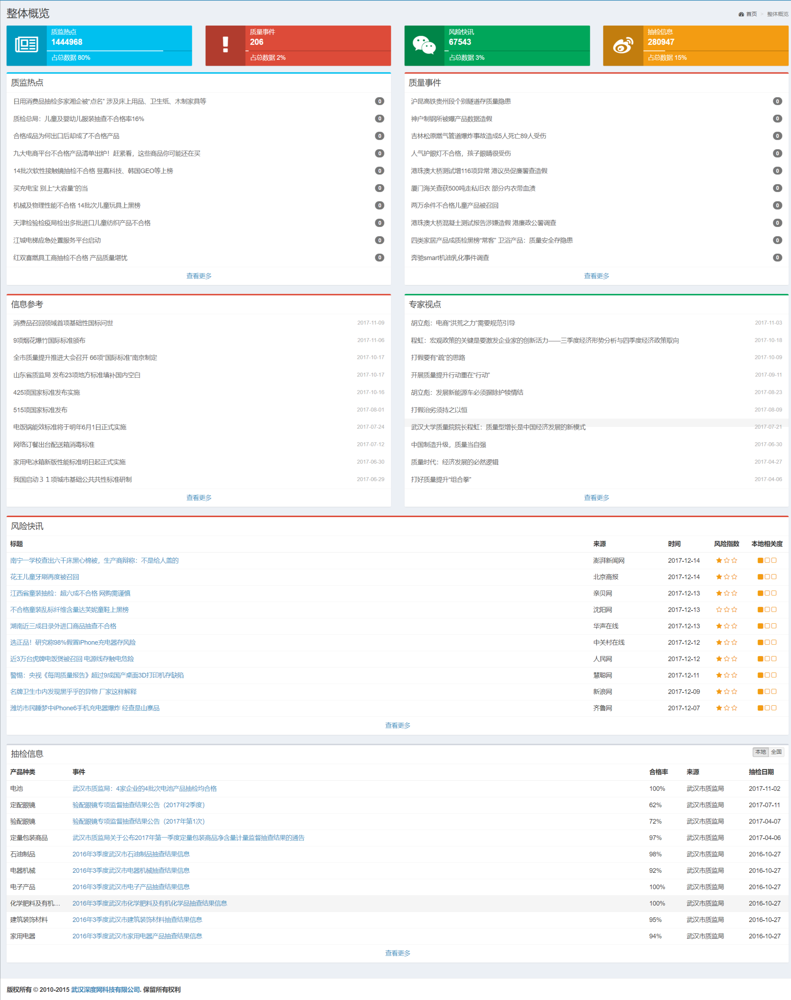
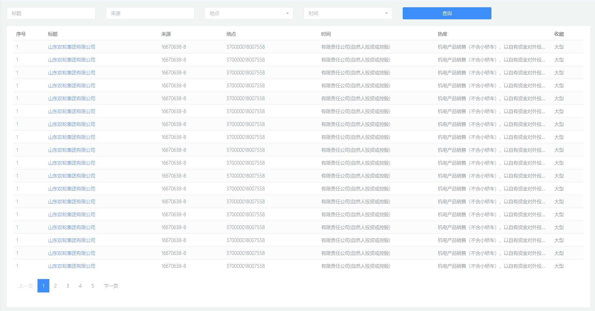

# 功能描述

> tips:
- (): 说明性文字
- []: 对应api中 key
- start: 列表页数 (默认0)
- length: 列表长度 (默认15)
- starttime: 开始时间 (默认today-30)
- endtime: 开始时间 (默认today)

### 首页 (API => /api/yqj/dashboard)

> 整体概览 (card*4)
- 质监热点(数量 / 占比) [zjrd_count / zjrd_proportion]
- 质量事件(数量 / 占比) [zlsj_count / zlsj_proportion]
- 风险快讯(数量 / 占比) [fxkx_count / fxkx_proportion]
- 抽检信息(数量 / 占比) [inspection_count / inspection_proportion]

> 质监热点 (table / col-md-6) [zjrd_list]
- 标题 (标题可点击) [title]
- 转载量 [reprinted]

> 质量事件 (table / col-md-6) [zlsj_list]
- 标题 (标题可点击) [title]
- 转载量 [reprinted]

> 信息参考 (table / col-md-6) [xxck_list]
- 标题 (标题可点击) [title]
- 发布时间 [pubtime]

> 专家视点 (table / col-md-6) [zjsd_list]
- 标题 (标题可点击) [title]
- 发布时间 [pubtime]

> 风险快讯 (table / col-md-12) [fxkx_list]
- 标题 (标题可点击) [title]
- 来源 [source]
- 时间 [pubtime]
- 风险指数 [score]

> 抽检信息 (table / col-md-12) [inspection_list]
- 产品种类 [product]
- 事件 (标题可点击) [title]
- 合格率 [qualitied]
- 来源 [source]
- 抽检时间 [pubtime]

> 参考:
> 

### 质监热点 (API => /api/yqj/article)

> 过滤器 (col-md-12)
- 标题 (`input` like) [title]
- 来源 (`input` like) [source]
- 地点 (`select2`) [area]
- 时间 (`datepicker`) [starttime / endtime]

> 列表 (默认15条数据 / col-md-12) (API => /api/yqj/article?start=0&length=15)
- 序号
- 标题 (标题可点击) [title]
- 来源 [source]
- 地点 [area]
- 时间 [pubtime]
- 热度 [reprinted]
- 收藏 (icon 星星) [is_collection 1:已收藏, 0:未收藏]

> 参考:
> 

### 质量事件  (API => /api/yqj/event)

> 过滤器 (col-md-12)
- 标题 (`input` like) [title]
- 首发媒体 (`input` like) [source]
- 地点 (`select2`) [area]
- 时间 (`datepicker`) [starttime / endtime]

> 列表 (默认15条数据 / col-md-12) (API => /api/yqj/event?start=0&length=15)
- 序号
- 标题 (标题可点击) [title]
- 首发媒体 [source]
- 地点 [area]
- 时间 [pubtime]
- 热度 [reprinted]
- 收藏 (icon 星星) [is_collection 1:已收藏, 0:未收藏]

> 参考:
> ditto (同上类似)

### 信息参考  (API => /api/yqj/reference)

> 过滤器 (col-md-12)
- 标题 (`input` like) [title]
- 来源 (`input` like) [source]
- 时间 (`datepicker`) [starttime / endtime]

> 列表 (默认15条数据 / col-md-12) (API => /api/yqj/reference?start=0&length=15)
- 序号
- 标题 (标题可点击) [title]
- 来源 [source]
- 时间 [pubtime]
- 收藏 (icon 星星) [is_collection 1:已收藏, 0:未收藏]

> 参考:
> ditto (同上类似)

### 专家视点  (API => /api/yqj/insight)

> 过滤器 (col-md-12)
- 标题 (`input` like) [title]
- 来源 (`input` like) [source]
- 时间 (`datepicker`) [starttime / endtime]

> 列表 (默认15条数据 / col-md-12) (API => /api/yqj/insight?start=0&length=15)
- 序号
- 标题 (标题可点击) [title]
- 来源 [source]
- 时间 [pubtime]
- 收藏 (icon 星星) [is_collection 1:已收藏, 0:未收藏]

> 参考:
> ditto (同上类似)

### 风险快讯  (API => /api/yqj/risk)

> 过滤器 (col-md-12)
- 标题 (`input` like) [title]
- 来源 (`input` like) [source]
- 时间 (`datepicker`) [starttime / endtime]

> 列表 (默认15条数据 / col-md-12) (API => /api/yqj/risk?start=0&length=15)
- 序号
- 标题 (标题可点击) [title]
- 来源 [source]
- 时间 [pubtime]
- 风险指数 [score]
- 收藏 (icon 星星) [is_collection 1:已收藏, 0:未收藏]

> 参考:
> ditto (同上类似)

### 抽检信息  (API => /api/yqj/inspection)

> 过滤器 (col-md-12)
- 产品种类 (`input` like) [product]
- 事件 (`input` like) [title]
- 来源 (`input` like) [source]
- 抽检日期 (`datepicker`) [starttime / endtime]

> 列表 (默认15条数据 / col-md-12) (API => /api/yqj/inspection?start=0&length=15)
- 序号
- 产品种类 [product]
- 事件 (标题可点击) [title]
- 来源 [source]
- 抽检日期 [pubtime]
- 风险指数 [score]
- 收藏 (icon 星星) [is_collection 1:已收藏, 0:未收藏]

> 参考:
> ditto (同上类似)

### 业务信息-综合  (API => /api/yqj/category/综合)

> 过滤器 (col-md-12)
- 标题 (`input` like) [title]
- 来源 (`input` like) [source]
- 地点 (`select2`) [area]
- 时间 (`datepicker`) [starttime / endtime]

> 列表 (默认15条数据 / col-md-12) (API => /api/yqj/category/综合?start=0&length=15)
- 序号
- 标题 (标题可点击) [title]
- 来源 [source]
- 地点 [area]
- 时间 [pubtime]
- 热度 [reprinted]
- 收藏 (icon 星星) [is_collection 1:已收藏, 0:未收藏]

> 参考:
> ditto (同上类似)

### 业务信息-标准化  (API => /api/yqj/category/标准化)

> 过滤器 (col-md-12)
- ditto (同上)

> 列表 (默认15条数据 / col-md-12) (API => /api/yqj/category/标准化?start=0&length=15)
- ditto

### 业务信息-稽查打假  (API => /api/yqj/category/稽查打假)

> 过滤器 (col-md-12)
- ditto

> 列表 (默认15条数据 / col-md-12) (API => /api/yqj/category/稽查打假?start=0&length=15)
- ditto

### 业务信息-质量监管  (API => /api/yqj/category/质量监管)

> 过滤器 (col-md-12)
- ditto

> 列表 (默认15条数据 / col-md-12) (API => /api/yqj/category/质量监管?start=0&length=15)
- ditto

### 业务信息-科技兴检  (API => /api/yqj/category/科技兴检)

> 过滤器 (col-md-12)
- ditto

> 列表 (默认15条数据 / col-md-12) (API => /api/yqj/category/科技兴检?start=0&length=15)
- ditto

### 业务信息-特种设备  (API => /api/yqj/category/特种设备)

> 过滤器 (col-md-12)
- ditto

> 列表 (默认15条数据 / col-md-12) (API => /api/yqj/category/特种设备?start=0&length=15)
- ditto

### 业务信息-计量  (API => /api/yqj/category/计量)

> 过滤器 (col-md-12)
- ditto

> 列表 (默认15条数据 / col-md-12) (API => /api/yqj/category/计量?start=0&length=15)
- ditto

### 业务信息-认证监管  (API => /api/yqj/category/认证监管)

> 过滤器 (col-md-12)
- ditto

> 列表 (默认15条数据 / col-md-12) (API => /api/yqj/category/认证监管?start=0&length=15)
- ditto

### 业务信息-质量管理  (API => /api/yqj/category/质量管理)

> 过滤器 (col-md-12)
- ditto

> 列表 (默认15条数据 / col-md-12) (API => /api/yqj/category/质量管理?start=0&length=15)
- ditto